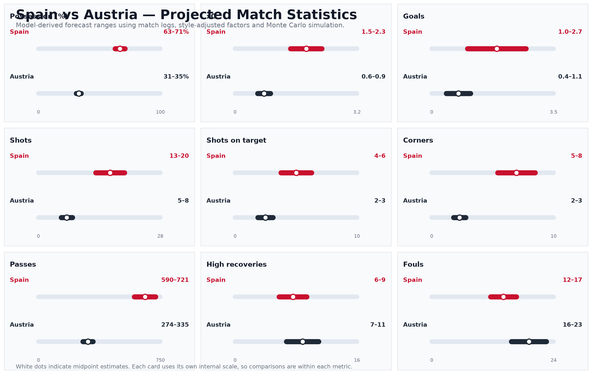
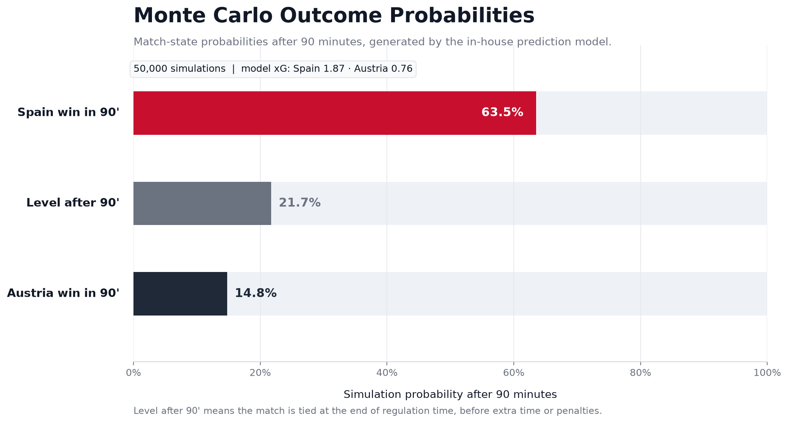
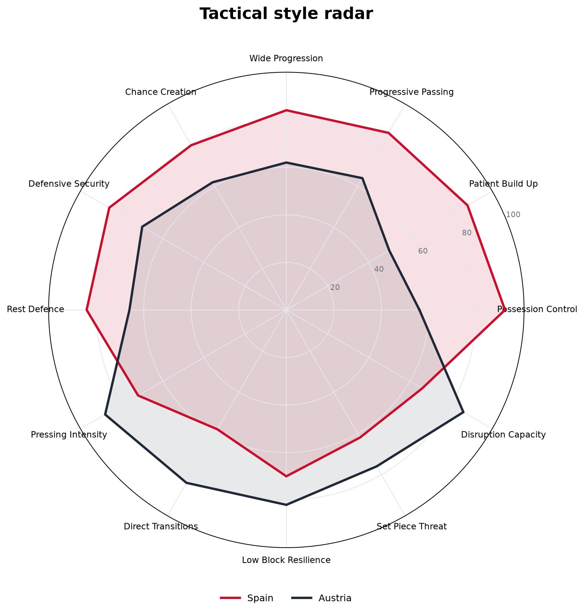
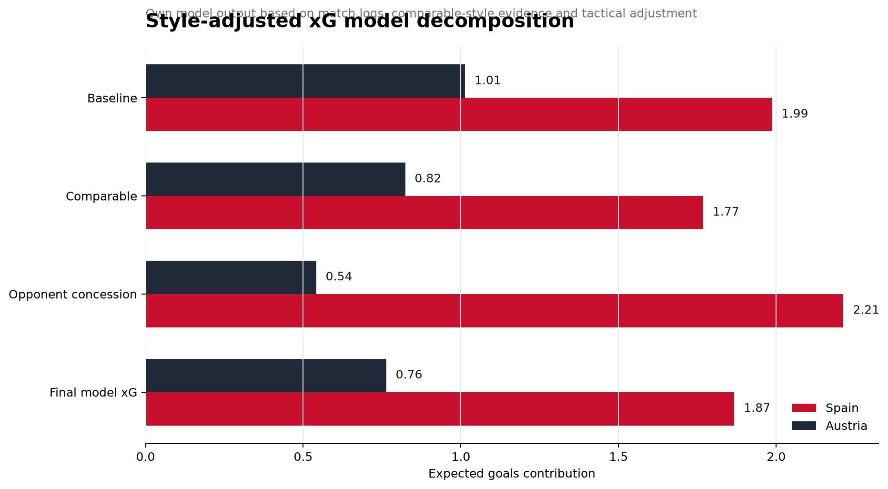
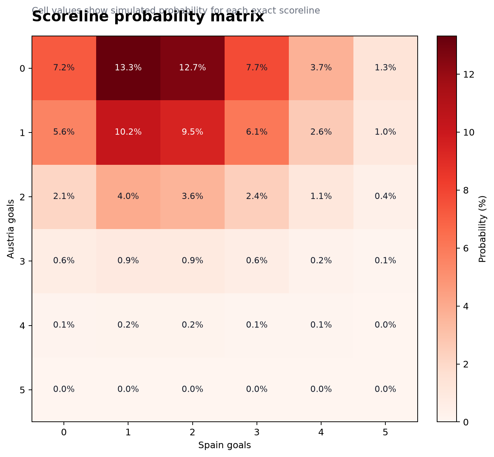
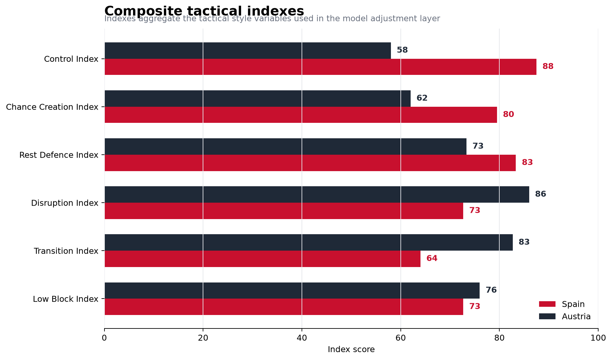
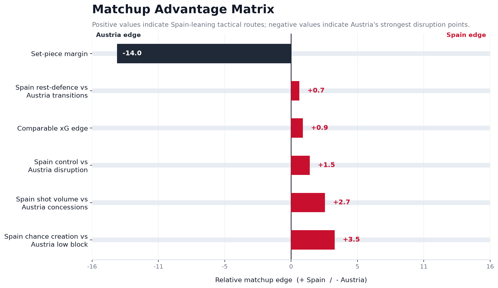

# Spain vs Austria — Style-Adjusted Matchup Forecast

A Python football analytics project modelling Spain vs Austria through recent match data, comparable-style opponents, tactical profiles, style-adjusted expected goals and Monte Carlo simulation.

The objective of this project is not to copy betting odds, media predictions or external score forecasts. Instead, it builds a transparent pre-match forecasting framework that can be evaluated after the match.

The model does **not** use betting odds, external score predictions or third-party forecast probabilities. It builds its own projection from:

- observed recent match logs;
- Spain against Austria-like opponents;
- Austria against Spain-like opponents;
- tactical style profiles;
- style-adjusted expected goals;
- Monte Carlo simulation;
- model-derived projected match statistics.

---

## Project overview

This project analyses the Spain vs Austria matchup using a style-adjusted football forecasting approach.

Instead of treating both teams only through generic averages, the model tries to account for the specific tactical relationship between both sides:

- Spain are evaluated through their ability to control possession, progress the ball, generate territory and create chances.
- Austria are evaluated through their ability to disrupt possession, press, transition quickly and create danger from lower-volume attacking situations.
- Comparable-style factors are used to adjust the baseline model:
  - Spain against compact, disruptive and transition-oriented opponents.
  - Austria against possession-dominant and territorially dominant opponents.

The final output is a set of model-derived projections, including:

- style-adjusted expected goals;
- simulated match outcome probabilities;
- most likely scoreline areas;
- projected match statistics;
- tactical style indicators;
- matchup advantage indicators;
- a post-match validation template.

---

## Repository structure

```text
matchup-forecast-spain-austria/
├── README.md
├── requirements.txt
├── .gitignore
├── data/
│   ├── spain_match_log.csv
│   ├── austria_match_log.csv
│   ├── comparable_matches.csv
│   ├── team_style_profiles.csv
│   ├── model_weights.csv
│   ├── source_register.csv
│   └── README.md
├── notebooks/
│   └── spain_austria_prediction_model.ipynb
├── outputs/
│   ├── 01_style_adjusted_xg_decomposition.png
│   ├── 02_monte_carlo_outcome_probabilities.png
│   ├── 03_scoreline_probability_matrix.png
│   ├── 04_projected_match_stats_forecast_card.png
│   ├── 05_tactical_style_radar.png
│   ├── 06_composite_tactical_indexes.png
│   ├── 07_matchup_advantage_heatmap.png
│   ├── model_derived_projected_stats.csv
│   └── post_match_validation_template.csv
├── reports/
│   └── methodology_note.md
└── src/
    ├── model.py
    └── visualizations.py
```

---

## Methodology

The model follows a style-adjusted forecasting workflow.

### 1. Match data layer

The project starts from recent match logs for Spain and Austria. These logs contain team-level performance indicators such as goals, shots, shots on target, possession, expected goals and defensive concessions.

The goal of this layer is to establish a recent-performance baseline for each team.

### 2. Comparable-style layer

A key part of the project is the comparable-style adjustment.

The model does not only ask:

> How strong are Spain and Austria in general?

It also asks:

> How has Spain performed against opponents with Austria-like characteristics?  
> How has Austria performed against opponents with Spain-like characteristics?

This adds a matchup-specific component to the forecast.

The comparable layer focuses on:

- Spain against compact, disruptive and transition-oriented teams.
- Austria against possession-dominant and territorially dominant teams.

### 3. Tactical profile layer

The project builds tactical style profiles for both teams using structured indicators such as:

- possession control;
- chance creation;
- progression volume;
- defensive security;
- pressing disruption;
- transition threat;
- low-block resistance;
- set-piece threat.

These style indicators are then used to adjust the expected-goals estimate.

### 4. Style-adjusted xG model

The model estimates an attacking expectation for each team.

This is not a copied xG forecast from another website. It is generated inside the project using:

- recent attacking baseline;
- defensive opponent profile;
- comparable-style factors;
- tactical adjustment weights;
- matchup-specific strengths and weaknesses.

The result is a style-adjusted expected-goals estimate for Spain and Austria.

### 5. Monte Carlo simulation

Using the model-generated expected goals, the notebook simulates the match many times.

The simulation produces:

- Spain win probability after 90 minutes;
- level score after 90 minutes;
- Austria win probability after 90 minutes;
- scoreline probability matrix;
- most likely scoreline areas.

The middle category, **level after 90 minutes**, means the match is tied at the end of regulation time and would require extra time or penalties.

### 6. Projected match statistics

The projected match statistics are derived from the model output. They are not manually inserted as final assumptions.

The project generates ranges for:

- possession;
- expected goals;
- goals;
- shots;
- shots on target;
- corners;
- passes;
- high recoveries;
- fouls.

These are model-derived ranges designed to be compared with the real match data after the game.

---

## Visual outputs

### Model-derived projected match statistics

This chart summarises the model-derived statistical ranges for both teams.



---

### Monte Carlo outcome probabilities

This chart shows the distribution of simulated outcomes after 90 minutes.



---

### Tactical style profile

This radar chart compares the tactical profile of both teams across different style indicators.



---

### Style-adjusted xG decomposition

This chart explains how the model moves from baseline team strength to style-adjusted expected goals.



---

### Scoreline probability matrix

This matrix shows the most common scoreline areas generated by the Monte Carlo simulation.



---

### Composite tactical indexes

This chart summarises the main tactical indexes used in the model.



---

### Matchup advantage indicators

This chart shows which tactical matchups lean towards Spain and which ones create possible Austria advantages.



---

## Main outputs

```text
01_style_adjusted_xg_decomposition.png
02_monte_carlo_outcome_probabilities.png
03_scoreline_probability_matrix.png
04_projected_match_stats_forecast_card.png
05_tactical_style_radar.png
06_composite_tactical_indexes.png
07_matchup_advantage_heatmap.png
model_derived_projected_stats.csv
post_match_validation_template.csv
```

---

## Data quality and assumptions

The project separates different types of inputs:

- `observed_public_report`: values taken from public match reports or match centres.
- `research_input`: pre-match comparable values added as structured research inputs.
- `scouting_proxy`: tactical style values used for the model adjustment layer.
- `model_output`: values generated by the model.

This distinction is intentional.

The notebook is designed to make clear what is:

- observed;
- structured as an analytical input;
- inferred through the model;
- generated as a model output.

This matters because football data projects often mix raw data, assumptions and interpretation. In this project, those layers are separated as clearly as possible.

---

## Limitations

This is not a betting model.

The model does not use:

- betting odds;
- external score predictions;
- third-party forecast probabilities;
- tracking data;
- event-location data;
- player-level tracking sequences.

Some tactical indicators are structured analytical inputs used to support the style-adjustment layer. They help the model represent tactical tendencies, but they should not be interpreted as directly measured tracking-data variables.

The model is designed to be transparent and reproducible, but its outputs should be evaluated after the match using actual match statistics.

For this reason, pitch-map diagrams were intentionally excluded from the final version of the project. Without tracking data or event-location data, manually drawn tactical arrows would be interpretative rather than directly model-generated.

---

## Validation

A key part of this project is the post-match validation layer.

After the match, the file below can be filled with real match statistics:

```text
outputs/post_match_validation_template.csv
```

The validation layer is designed to compare the model against actual post-match data such as:

- possession;
- expected goals;
- goals;
- shots;
- shots on target;
- corners;
- passes;
- high recoveries;
- fouls;
- dangerous turnovers.

The goal is not only to predict the match, but to evaluate whether the model captured the structure of the game correctly.

---

## How to run

Install the required dependencies:

```bash
pip install -r requirements.txt
```

Open the notebook:

```bash
jupyter notebook notebooks/spain_austria_prediction_model.ipynb
```

Then run:

```text
Kernel → Restart & Run All
```

The notebook will generate the charts and CSV outputs inside the `outputs/` folder.

---

## Technologies used

- Python
- pandas
- NumPy
- Matplotlib
- Jupyter Notebook
- Monte Carlo simulation
- Football analytics modelling

---

## Project objective

This project was built as a practical football analytics case study.

The main objective was to turn a tactical question into a reproducible analytical workflow:

> Can a pre-match forecast be built from team performance, comparable playing styles and tactical indicators without relying on external predictions?

The result is a transparent style-adjusted matchup forecast that can be reviewed, challenged and validated after the match.
